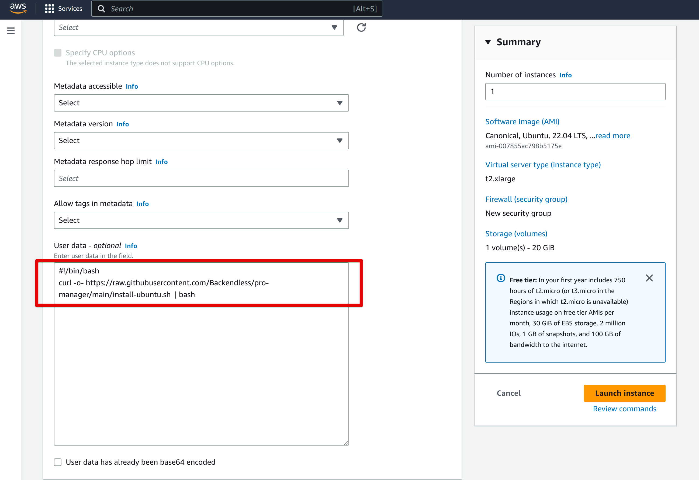
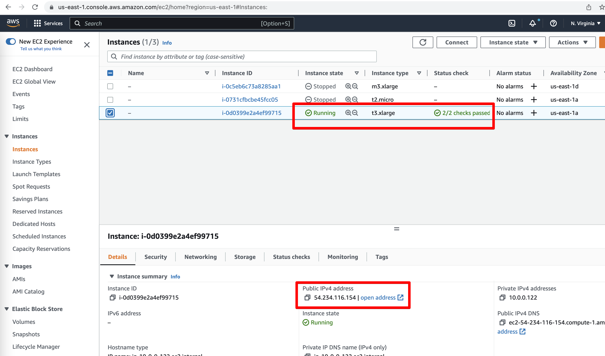

# Installing Backendless PRO in AWS EC2
Watch the video below with instructions for how to install, configure and run Backendless Pro in the Azure environment.
<div align="left">
      <a href="https://youtu.be/Lz3vh_oy27o">
         
      </a>
</div>

### Requirements
Amazon Machine Image (AMI) must comply with the following requirements:
- 8Gb memory
- 4 CPU
- 20 GB disk space

### Installation
1. Start EC2 instance with **Ubuntu** OS instance with the following `User data`
```
#!/bin/bash
curl -o- https://raw.githubusercontent.com/Backendless/pro-manager/main/install-ubuntu.sh  | bash
```
Make sure the following ports are available for you:
```
- 5050  - Pro manager web
- 5051  - Pro manager web socket
- 32300 - API
- 32400 - Web console
- 32600 - Consul( configuration values )
```
The script form user data will do all the same as for [ubuntu](https://github.com/Backendless/pro-manager#ubuntu)


2. Wait until the instance became available and copy public ip or url

3. Open a browser and navigate to `http://<your-public-ip>:5050` to access Backendless PRO Manager. 
4. Fill out the form and start the installation of the product.

### Domain configuration
Follow [documentation](aws-elb-configuration.md) to configure domains
