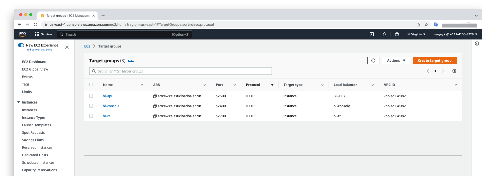
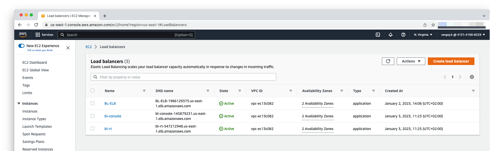
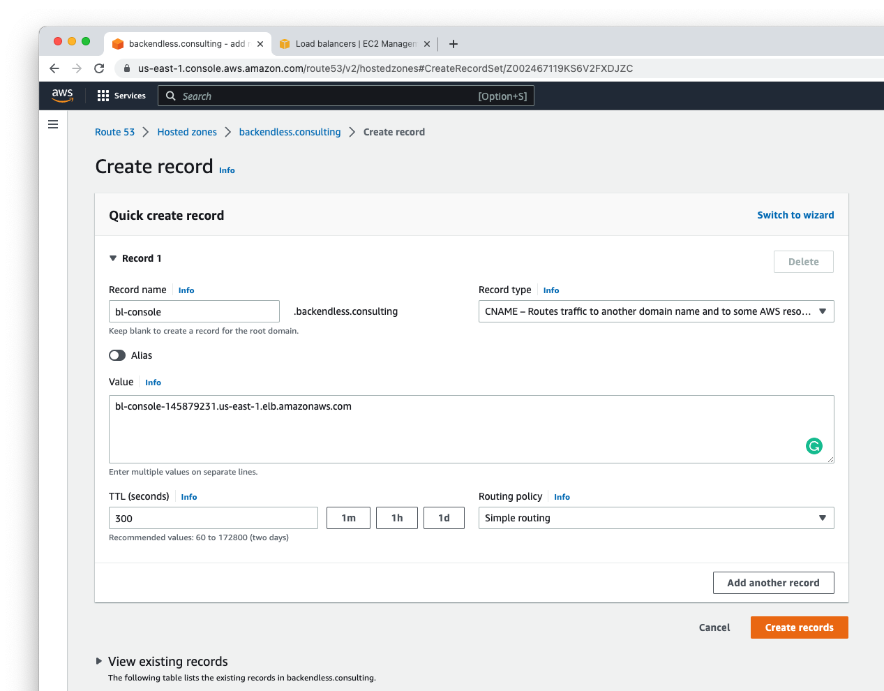
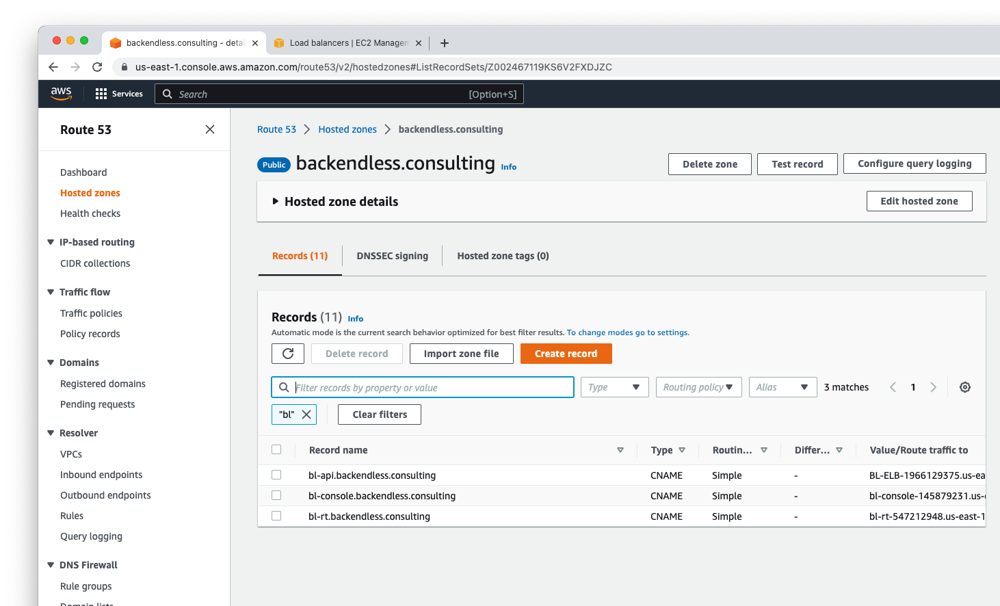
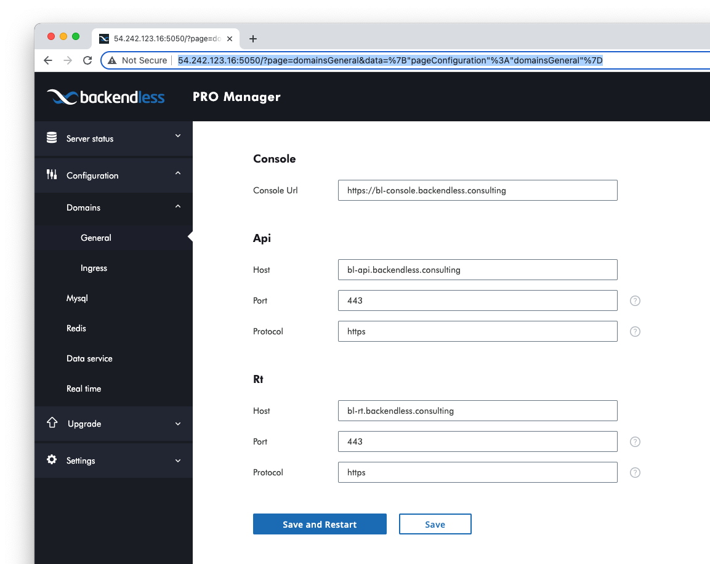

# ELB configuration

### 1. Create targets
You should create at least 3 target groups for API, development console and for real-time.
Go through the following steps for each target group
1. Go to `EC2 > Target groups` and press `Create target group` button
2. Choose `Instances` as target type
3. Provide `Target group name`:
 - bl-api
 - bl-console
 - bl-rt
4. Choose `HTTP` protocol and port the following ports for each:
```
32300 - API
32400 - backendless console
32700 - real-time
```
5. Select the same VPC as for you EC2 instance
6. Use `HTTP1` Protocol version
7. Health checks for API and development console should not be changed. \
For real-time target group `Health check path` should be `/health`, in `Advanced health check settings` section choose `Override` for port and provide `32692` port number
8. Press `Next` button 
9. Choose instance with backendless pro
10. Press `Include as pending bellow` button
11. Press `Create target group`button

At the end your target page should look like the on the following screen


### 2. Create Load balancers
You should create at least 3 load balancers for API, development console and for real-time.
Go through the following steps for each load balancer
1. Go to `EC2 > Load balancers` and press `Create load balancer` button
2. Use `Application Load Balancer` type
3. Provide `Load balancer name`
- bl-api
- bl-console
- bl-rt
4. Use `Internet-facing` as schema 
5. Use `IPv4`
6. Choose `Network mapping` and `Security groups`
7. For `Listeners and routing` and routing use `HTTPS` protocol and choose appropriate `Default action`.
Also, you may add listener for 80 port for debug
8. Choose `Default SSL/TLS certificate` for your domain
9. Press `Create load balancer` button

At the end your Load balancers page should look like the on the following screen


### 3. Create domains 
1. Go to `Route 53 > Hosted zones > your-domain.com`
2. Press `Create record` button
3. You should create 3 subdomain
- bl-api
- bl-console
- bl-rt
4. Choose `CNAME` as record type
5. Provide load balancer `DNS name` as Value

6. Press `Create records` button


### 4. Configure domain in Pro Manager
1. Go to `Configuration > Domains > General` http://<public-ip>:5050/?page=domainsGeneral&data=%7B%22pageConfiguration%22%3A%22domainsGeneral%22%7D
2. Provide domains for each section
3. Press `Save and Restart` button 

4. Go to `Server status > All` page, wait while status became `Running` for all processes  