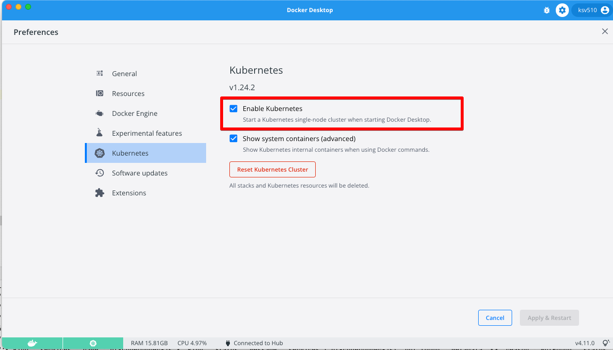

# About
**Pro Manager** is a backendless product created to simplify installation and managing on-premise Backendless version.

# Requirements
- 8Gb memory
- 4 CPU
- 20 GB disk space

## Installation
### [AWS EC2 basic installation](./Doc/aws-ec2-basic.md)

<details>
<summary>Ubuntu</summary>
The following way of installation should work for any Debian-based OS.

Open terminal and execute the following command
```
curl -o- https://raw.githubusercontent.com/Backendless/pro-manager/main/install-ubuntu.sh  | bash
```

At the end, Pro Manager will be available in a browser by the following link `http://<your-ip>:5050`.

The following steps will be done during the installation:
- `bl-pro-manager` user will be created
- installed node v14.18.2
- installed k3s without traefik
- installed ingress-nginx
- current project cloned to the following folder `/home/bl-pro-manager/pro-manager`
- created service `pro-manager.service`

Pro Manager will be automatically started. To stop/start/restart use `systemctl`.
```
sudo systemctl start pro-manager.service
sudo systemctl restart pro-manager.service
sudo systemctl stop pro-manager.service
sudo systemctl status pro-manager.service
```

To get Pro Manager logs use `journalctl` 
```
journalctl -u pro-manager.service -f
```
</details>

<details>
<summary>Mac OS / Windows</summary>

- Install Docker desktop https://www.docker.com/products/docker-desktop/
- Go to preference and enable kubernetes 
- Make sure kubectl is available and works in terminal
```
ksv510@Sergeys-MacBook-Pro ~ % kubectl get nodes
NAME             STATUS   ROLES           AGE    VERSION
docker-desktop   Ready    control-plane   117d   v1.24.2
```

## Domains

- If you plan to use custom domains you need to install ingress https://kubernetes.github.io/ingress-nginx/deploy/#quick-start
```
kubectl apply -f https://raw.githubusercontent.com/kubernetes/ingress-nginx/controller-v1.5.1/deploy/static/provider/cloud/deploy.yaml
```
- If you plan to use a letsencrypt certificate, install cert-manager
```
kubectl apply -f https://github.com/cert-manager/cert-manager/releases/download/v1.12.0/cert-manager.yaml
```
- Follow instructions to [start Pro Manager](#start-pro-manager) 
</details>

<details>
<summary>Installation on any other platform</summary>  

- Install node v14.18.2
  ```
  curl -o- https://raw.githubusercontent.com/nvm-sh/nvm/v0.39.1/install.sh | bash \
    && source ~/.bashrc \
    && nvm install v14.18.2
  ```
- Install k3s 
  ```
    curl -sfL https://get.k3s.io | sh - \
     && mkdir ~/.kube \
     && echo "export KUBECONFIG=~/.kube/config" >> ~/.bashrc \
     && source ~/.bashrc \
     && sudo k3s kubectl config view --raw > "$KUBECONFIG"
     && kubectl get nodes
    ```
 - Make sure that you have access to kubectl. Execute `kubectl get nodes`. The result should as the following:
    ```
    sergey.kukurudzyak@dev-k3s:~/pro-manager$ kubectl get nodes
    NAME                         STATUS   ROLES                  AGE   VERSION
    dev-k3s.us.backendless.com   Ready    control-plane,master   19h   v1.24.3+k3s1
    ```

## Domains

  - If you plan to use custom domains, you need to install ingress https://kubernetes.github.io/ingress-nginx/deploy/#quick-start
```
kubectl apply -f https://raw.githubusercontent.com/kubernetes/ingress-nginx/controller-v1.5.1/deploy/static/provider/cloud/deploy.yaml
```
- If you plan to use a letsencrypt certificate, install cert-manager
```
kubectl apply -f https://github.com/cert-manager/cert-manager/releases/download/v1.12.0/cert-manager.yaml
```  
</details>  

# Management
  <details>
<summary>Checking available ports</summary>
 
Make sure the following ports are available for you:

- 5050  - Pro manager web
- 5051  - Pro manager web socket
- 32300 - API
- 32400 - Web console
- 32600 - Consul( configuration values )
</details>  

<details>
<summary>Start pro-manager from repository</summary>
  
### Start Pro Manager
- Clone Pro Manager
```
git clone https://github.com/Backendless/pro-manager.git
```
- Go to the folder pro-manager
- Execute 
```
  npm i
  ```
- Execute 
```
  npm run start
  ```
- Open the following link in browser http://localhost:5050
</details>  

<details>
<summary>Upgrade Pro Manager from repository</summary>
  
### Upgrade Pro Manager
1. Stop Pro Manager
2. Goto `pro-manager` folder for example on ubuntu it is `/home/bl-pro-manager/pro-manager`
3. Execute `git pull` command
4. Execute `npm i`
5. Start Pro Manager
</details>   

  <details>
<summary>Remove Backendless Pro and Pro Manager</summary>

### Remove Backendless Pro
```
curl -X DELETE 'http://localhost:5050/services/install/delete' \
--header 'Content-Type: application/json' \
--header 'Cookie: auth-token=<auth-token>'
```
### Remove Pro Manager in Ubuntu
For ubuntu call the following commands:
```
sudo systemctl stop pro-manager
```
```
sudo deluser --remove-home bl-pro-manager
```
</details>

<details>
<summary>Troubleshooting</summary>

[Ingress](Doc/ingress-troubleshooting.md)
</details>
