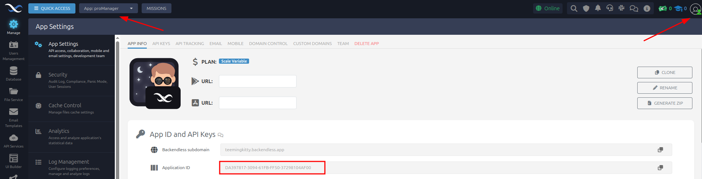
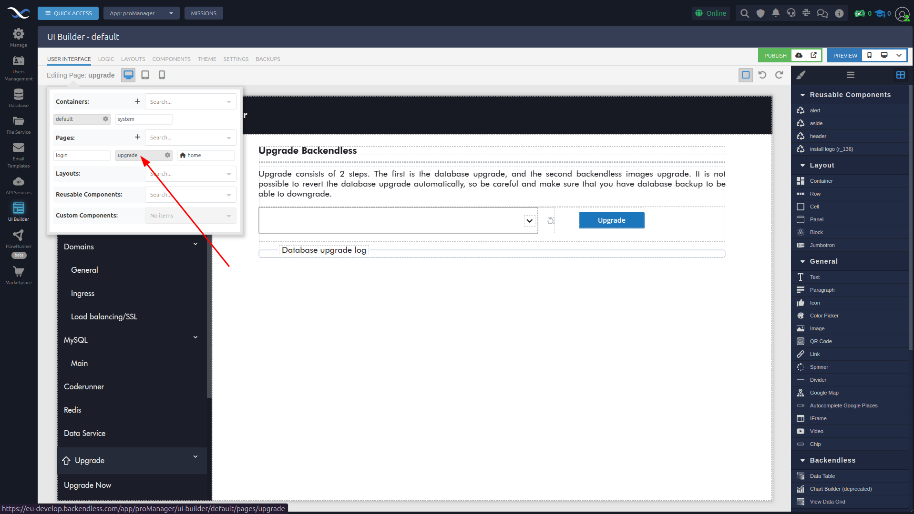
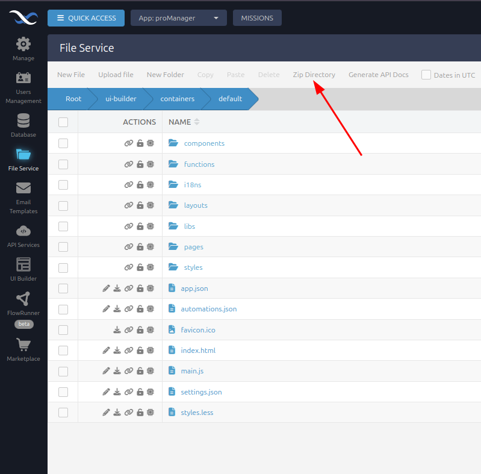
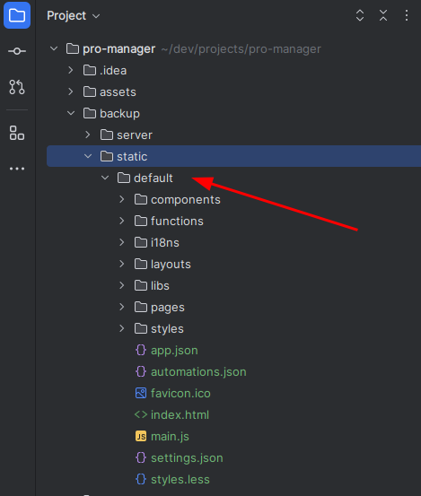
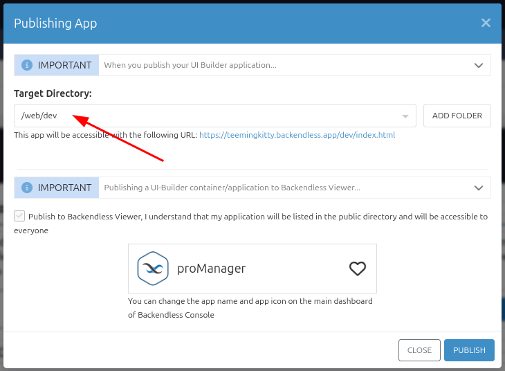
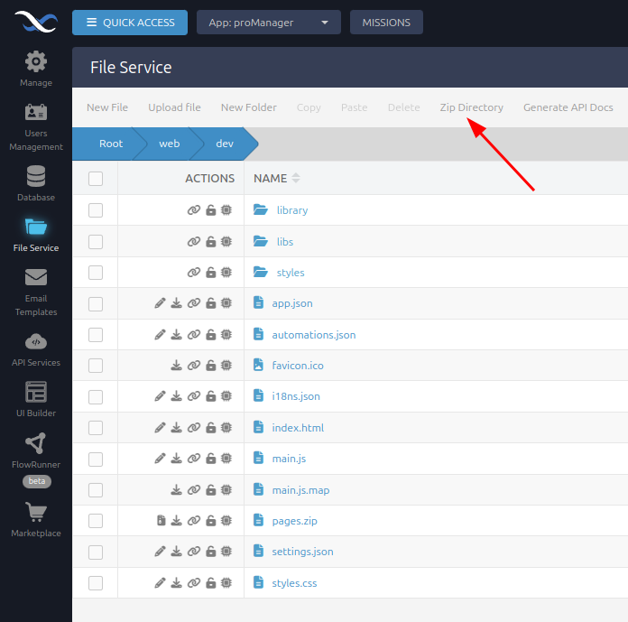
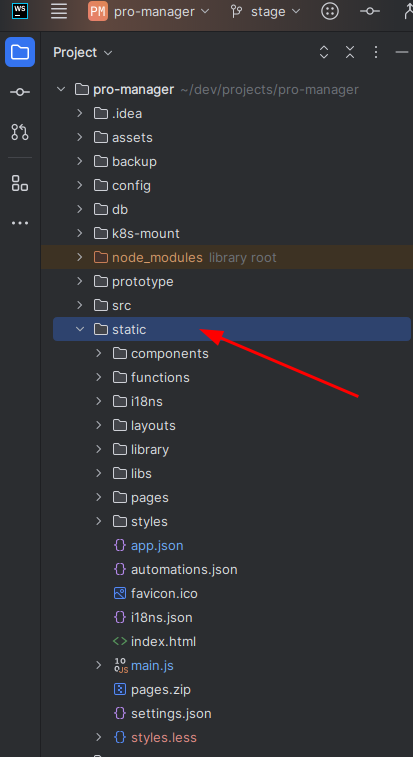
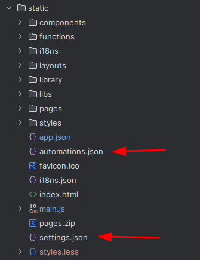

## Modify UI in Pro Manager

This guide explains how to make UI changes in the **Pro Manager** application using **Backendless UI Builder** and deploy the changes to your local setup.

###  1) Open the `proManager` application:

- Go to the [EU Backendless](https://eu-develop.backendless.com/) and login as a system dev.
- Navigate to the **proManager** app:
  > Application ID: `DA397817-3094-61FB-FF50-37298104AF00`

   

### 2) Locate and edit the required page:

- Go to the **UI Builder** section.
- Open the `container -> page` you want to update:
        

- Make the required changes directly in the visual editor.
- Test your changes in **Preview Mode** to ensure everything works as expected.

###  3. Download the modified container files:

- After completing your changes, go to the **File Service** section.
- Navigate to the `default` folder:
  > /ui-builder/containers/default

- Create a ZIP archive of the entire `default` directory and download it:
        

- Move the archive to your local **pro-manager** project in the `static` folder:
  > /backup/static

  

###  4. Publish the updated container and update target files:

- Return to the **UI Builder** section.
- Publish the updated container:
        
  
- The published files will be available in the **Files Service** section in the `dev` directory:
  > /web/dev

- Create a ZIP archive of the `dev` directory and download it:
      

- Unzip the archive.
- Move the contents into the `static` folder of the **pro-manager** project:
  > /static

     

- **⚠️ Revert changes in the `automation.json` and `settings.json` files:** 
        
